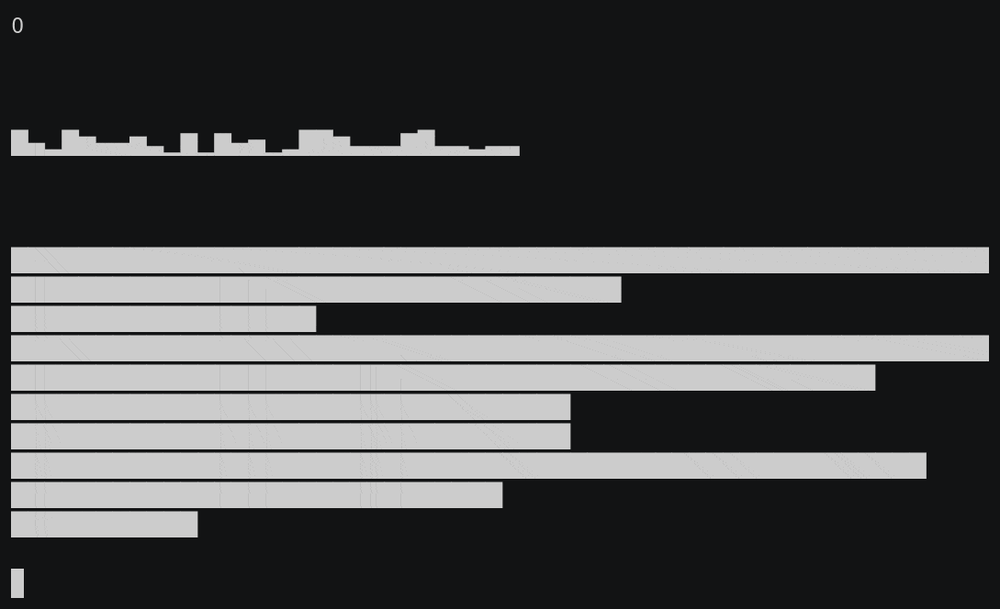

# TextGraph

[](https://travis-ci.org/markeganfuller/pytextgraph)
[](https://codecov.io/gh/markeganfuller/pytextgraph)

Python library for generating simple text graphs.

Based on code by [Rory McCann](https://github.com/rory)



## Install

```bash
pip install textgraph
```

## Usage

```python
import textgraph

data = [12, 5, 2, 7]

print(textgraph.spark(data))
```

See more examples in `examples.py`
